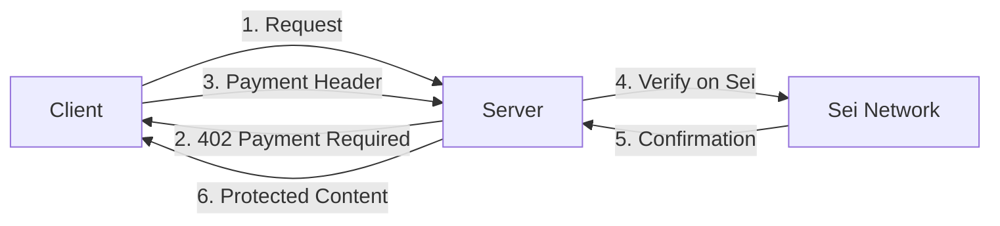

## Build Paid APIs on Sei

x402 Protocol brings HTTP micropayments to the Sei Network, enabling you to monetize APIs, premium content, and digital services with instant, low-cost payments. Whether you're building AI APIs, data feeds, or premium content platform ,X402 makes it simple to add payment gates to any HTTP endpoint.

**Works with Sei's advantages:** Sei's fast finality, low gas fees, and EVM compatibility make it perfect for micropayments. X402 leverages these features to enable seamless payment flows that complete in milliseconds.

<CardGroup cols={2}>
  <Card title="Quick Start" href="/quickstart" icon="play">
    Build your first paid API on Sei in under 10 minutes
  </Card>
  <Card title="Sei Integration" href="/sei/introduction" icon="coins">
    Learn how X402 leverages Sei's unique features
  </Card>
</CardGroup>

## Why X402 on Sei?

<AccordionGroup>
  <Accordion title="Fast & Cheap Payments" icon="bolt">
    Sei's 300ms finality and low gas fees make micropayments practical. Perfect
    for pay-per-request APIs and streaming content.
  </Accordion>
  <Accordion title="EVM Compatible" icon="code">
    Use familiar tools like Viem, Ethers.js, and Hardhat. All existing Ethereum
    tooling works seamlessly on Sei.
  </Accordion>
  <Accordion title="Built-in Wallet Support" icon="wallet">
    Integrates with Sei wallets, MetaMask, and any EIP-6963 compatible wallet
    for smooth user experiences.
  </Accordion>
</AccordionGroup>

## How X402 Works

X402 adds payment headers to HTTP requests, enabling servers to require payment before processing requests:



## Use Cases on Sei

<CardGroup cols={2}>
  <Card title="AI API Monetization" icon="robot" href="/examples/streaming-api">
    **Charge per AI inference** Monetize LLM APIs, image generation, or data
    processing with per-request payments. ```bash # Pay 0.01 SEI per API call
    curl -H "X-402-Payment: ..." api.example.com/ai/generate ```
  </Card>

{" "}

<Card
  title="Premium Content Gates"
  icon="lock"
  href="/examples/premium-content"
>
  **Subscription & pay-per-view** Create premium content with flexible payment
  models - subscriptions, one-time payments, or time-based access. ```bash #
  Unlock premium article for 24 hours curl -H "X-402-Payment: ..."
  news.example.com/premium/article ```
</Card>

{" "}

<Card
  title="Data Feed Monetization"
  icon="chart-line"
  href="/examples/next-auth"
>
  **Real-time data access** Monetize market data, weather APIs, or any real-time
  information feed with instant payments. ```bash # Pay for real-time market
  data curl -H "X-402-Payment: ..." data.example.com/market/prices ```
</Card>

  <Card title="Decentralized CDN" icon="globe" href="/sei/streaming-payments">
    **Content delivery payments** Pay for bandwidth, storage, or compute
    resources on a per-use basis with streaming payments. ```bash # Stream
    payments for video content curl -H "X-402-Payment: ..."
    cdn.example.com/video/stream ```
  </Card>
</CardGroup>

## Package Ecosystem

<CardGroup cols={2}>
  <Card
    title="@x402/client"
    icon="download"
    href="/clients/typescript/installation"
  >
    **Client-side payments** Add X402 payment capabilities to any
    TypeScript/JavaScript application. ```bash npm install @x402/client ```
  </Card>

{" "}

<Card title="@x402/facilitator" icon="server" href="/facilitators/introduction">
  **Server-side payment processing** Accept and verify X402 payments in your
  Node.js applications. ```bash npm install @x402/facilitator ```
</Card>

{" "}

<Card title="@x402/express" icon="route" href="/clients/express">
  **Express.js middleware** Add payment gates to Express routes with simple
  middleware. ```bash npm install @x402/express ```
</Card>

{" "}

<Card title="@x402/next" icon="next-dot-js" href="/clients/next">
  **Next.js integration** Full-stack Next.js applications with built-in payment
  support. ```bash npm install @x402/next ```
</Card>

{" "}

<Card title="@x402/hono" icon="flame" href="/clients/hono">
  **Hono framework support** Lightweight payments for edge computing and
  serverless functions. ```bash npm install @x402/hono ```
</Card>

  <Card title="@x402/paywall" icon="paywall" href="/paywall/introduction">
    **Drop-in paywall system** Complete paywall solution with customizable UI
    components. ```bash npm install @x402/paywall ```
  </Card>
</CardGroup>

<Info>
🏗️ **Ready-to-Deploy Templates**

Get started instantly with our **full-stack templates** featuring Sei wallet integration, payment processing, and beautiful UIs. Perfect for launching paid APIs, premium content platforms, or subscription services.

[Explore Templates →](/examples/next-auth)

</Info>

## Community & Support

- [GitHub Discussions](https://github.com/coinbase/x402/discussions) - Ask questions and discuss features
- [Sei Discord](https://discord.gg/sei) - Join the Sei developer community
- [Sei Documentation](https://docs.sei.io) - Complete Sei protocol documentation

## Report Issues

- [GitHub Issues](https://github.com/coinbase/x402/issues) - Report bugs and request features
- Include reproduction steps and environment details
- Check existing issues before creating new ones
