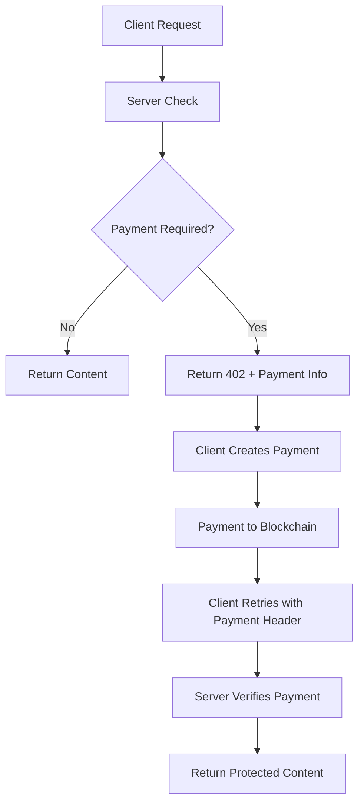

# X402 Protocol Overview

X402 transforms any HTTP endpoint into a paid service using blockchain micropayments. Originally designed as an extension to HTTP status codes, X402 enables seamless monetization of APIs, content, and digital services.

## How x402 Works

The protocol adds payment capabilities to standard HTTP by introducing payment headers and the `402 Payment Required` status code:



## Core Components

<CardGroup cols={2}>
  <Card title="402 Status Code" icon="warning">
    **HTTP Payment Required** Standard HTTP status indicating payment is needed
    to access the resource.
  </Card>
  <Card title="Payment Headers" icon="header">
    **X-402-Payment Headers** Cryptographic proof of payment embedded in HTTP
    requests.
  </Card>
</CardGroup>

<CardGroup cols={2}>
  <Card title="Facilitators" icon="server">
    **Payment Processors** Server-side components that handle payment
    verification and enforcement.
  </Card>
  <Card title="Clients" icon="computer">
    **Payment Makers** Client libraries that automatically handle payment
    creation and retry logic.
  </Card>
</CardGroup>

## Payment Schemes

X402 supports multiple payment models to fit different use cases:

<Tabs>
  <Tab title="Exact Payments">
    **Fixed amount per request**
    
    Perfect for API calls, premium content access, and one-time purchases.
    
    ```javascript
    const facilitator = createFacilitator({
      scheme: 'exact',
      price: '0.01', // Exactly 0.01 SEI per request
      currency: 'SEI'
    });
    ```
    
    **Use cases:**
    - API endpoint access
    - Premium article unlock
    - Image/file downloads
    - AI model inference
  </Tab>
  
  <Tab title="Streaming Payments">
    **Pay-per-use or time-based**
    
    Ideal for real-time data, video streaming, or compute-intensive tasks.
    
    ```javascript
    const facilitator = createFacilitator({
      scheme: 'streaming',
      pricePerSecond: '0.001', // 0.001 SEI per second
      maxDuration: 3600 // 1 hour maximum
    });
    ```
    
    **Use cases:**
    - Real-time data feeds
    - Video/audio streaming
    - Compute resource access
    - Live API monitoring
  </Tab>
  
  <Tab title="Subscription Model">
    **Time-based access tokens**
    
    Enable recurring access with blockchain-verified time periods.
    
    ```javascript
    const facilitator = createFacilitator({
      scheme: 'subscription',
      price: '1.0', // 1 SEI per month
      duration: 30 * 24 * 60 * 60 // 30 days in seconds
    });
    ```
    
    **Use cases:**
    - Monthly API access
    - Premium content subscriptions
    - SaaS service access
    - Data service plans
  </Tab>
</Tabs>

## Why Sei Network?

Sei's unique characteristics make it ideal for X402 micropayments:

<AccordionGroup>
  <Accordion title="Fast Finality (300ms)" icon="bolt">
    **Near-instant payment confirmation**
    
    Sei's optimistic parallelization achieves 300ms block times, making micropayments practical for real-time applications. Users don't wait for payment confirmation.
    
    ```javascript
    // Payment confirmed in ~300ms
    const response = await client.request('/api/data');
    // Content delivered immediately after confirmation
    ```
  </Accordion>
  
  <Accordion title="Ultra-Low Fees" icon="dollar-sign">
    **Economics that make sense**
    
    Gas fees typically under $0.001 make small payments viable. A $0.01 API call only costs ~$0.0001 in fees.
    
    ```javascript
    // Total cost breakdown for 0.01 SEI payment:
    // Payment: 0.01 SEI (~$0.01)
    // Gas fee: ~0.0001 SEI (~$0.0001)
    // Total: ~$0.0101
    ```
  </Accordion>
  
  <Accordion title="EVM Compatibility" icon="code">
    **Use familiar tools**
    
    Full compatibility with Ethereum tooling means you can use Viem, Ethers.js, Hardhat, and all existing infrastructure.
    
    ```javascript
    // Standard EVM tools work seamlessly
    import { createPublicClient, http } from 'viem';
    
    const client = createPublicClient({
      chain: sei,
      transport: http('https://evm-rpc.sei-apis.com')
    });
    ```
  </Accordion>
</AccordionGroup>

## Payment Flow Deep Dive

### 1. Initial Request

Client makes a standard HTTP request to a protected endpoint:

```http
GET /api/premium-data HTTP/1.1
Host: api.example.com
Accept: application/json
```

### 2. Payment Required Response

Server responds with payment requirements:

```http
HTTP/1.1 402 Payment Required
Content-Type: application/json
X-402-Accept: SEI
X-402-Amount: 0.01
X-402-Network: sei
X-402-Recipient: 0x742d35Cc6634C0532925a3b8D0aC9C61cf7D0A3e

{
  "error": "Payment Required",
  "amount": "0.01",
  "currency": "SEI",
  "network": "sei",
  "recipient": "0x742d35Cc6634C0532925a3b8D0aC9C61cf7D0A3e"
}
```

### 3. Payment Creation

Client creates and broadcasts payment transaction:

```javascript
// X402 client automatically handles this
const tx = await wallet.sendTransaction({
  to: "0x742d35Cc6634C0532925a3b8D0aC9C61cf7D0A3e",
  value: parseEther("0.01"),
  // Additional metadata for verification
});
```

### 4. Payment Verification Request

Client retries with payment proof:

```http
GET /api/premium-data HTTP/1.1
Host: api.example.com
Accept: application/json
X-402-Payment: sei:1329:0x8f2a9e4c...transaction_hash_here
X-402-Payment-Amount: 0.01
X-402-Payment-Network: sei
```

### 5. Content Delivery

Server verifies payment and returns content:

```http
HTTP/1.1 200 OK
Content-Type: application/json
X-402-Payment-Verified: true

{
  "data": "Premium content unlocked!",
  "timestamp": "2024-01-15T10:30:00Z"
}
```

## Security Model

X402 implements multiple layers of security:

<CardGroup cols={2}>
  <Card title="Cryptographic Verification" icon="shield">
    **Blockchain-based proof** All payments are verified on-chain with
    cryptographic signatures and transaction hashes.
  </Card>
  <Card title="Amount Validation" icon="calculator">
    **Exact amount checking** Servers verify the exact payment amount,
    preventing underpayment or overpayment attacks.
  </Card>
</CardGroup>

<CardGroup cols={2}>
  <Card title="Recipient Verification" icon="user-check">
    **Address validation** Payments must be sent to the exact recipient address
    specified by the server.
  </Card>
  <Card title="Network Isolation" icon="globe">
    **Chain-specific validation** Payments are verified on the specific
    blockchain network (mainnet vs testnet isolation).
  </Card>
</CardGroup>

## Performance Characteristics

Real-world performance metrics for X402 on Sei:

| Metric               | Sei Testnet | Sei Mainnet | Notes                             |
| -------------------- | ----------- | ----------- | --------------------------------- |
| **Payment Latency**  | 350ms avg   | 300ms avg   | Time from payment to verification |
| **Transaction Cost** | ~$0.0008    | ~$0.001     | Gas fees for payment transaction  |
| **Success Rate**     | 99.8%       | 99.9%       | Including automatic retries       |
| **Throughput**       | 1,200 TPS   | 2,000+ TPS  | Concurrent payments processed     |

## Use Case Examples

<CardGroup cols={2}>
  <Card title="AI API Monetization" icon="robot" href="/examples/streaming-api">
    **Per-inference payments** ```bash # Pay 0.01 SEI per AI generation curl -H
    "X-402-Payment: ..." \ api.ai.com/generate ```
  </Card>
  <Card
    title="Real-time Data Feeds"
    icon="chart-line"
    href="/sei/streaming-payments"
  >
    **Streaming market data** ```bash # Pay 0.001 SEI per second of data curl -H
    "X-402-Payment: ..." \ data.finance.com/live/prices ```
  </Card>
</CardGroup>

<CardGroup cols={2}>
  <Card title="Premium Content" icon="lock" href="/examples/premium-content">
    **Article/media access** ```bash # Unlock premium article for 24h curl -H
    "X-402-Payment: ..." \ news.example.com/premium/article ```
  </Card>
  <Card title="Compute Resources" icon="cpu" href="/facilitators/advanced">
    **Pay-per-compute model** ```bash # Pay for server processing time curl -H
    "X-402-Payment: ..." \ compute.cloud.com/process ```
  </Card>
</CardGroup>

## Getting Started

Ready to build with X402? Choose your path:

<CardGroup cols={2}>
  <Card title="Quick Start" href="/quickstart" icon="rocket">
    Build your first paid API in 10 minutes
  </Card>
  <Card title="Sei Integration" href="/sei/introduction" icon="coins">
    Deep dive into Sei-specific features
  </Card>
</CardGroup>

<CardGroup cols={2}>
  <Card
    title="Client Libraries"
    href="/clients/typescript/installation"
    icon="code"
  >
    Add payments to your existing app
  </Card>
  <Card title="Server Setup" href="/facilitators/introduction" icon="server">
    Accept payments in your API
  </Card>
</CardGroup>{" "}
