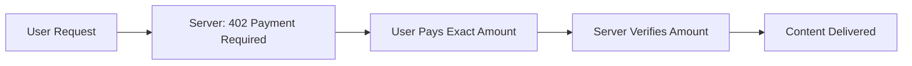

# Exact Payment Implementation

The exact payment scheme is perfect for API monetization, premium content access, and any scenario where you need precise payment amounts. This guide shows how to implement exact payments on Sei Network with X402.

<Info>
  **Perfect for:** API endpoints, premium articles, file downloads, AI inference
  calls, and any fixed-price digital service.
</Info>

## How Exact Payments Work

Exact payments require users to pay a specific amount to access protected content:



## Basic Implementation

<Steps>
  <Step title="Set up the server">
    Create a server with exact payment protection:
    
    ```typescript
    import express from 'express';
    import { createFacilitator } from '@x402/facilitator';
    
    const app = express();
    
    // Configure exact payment facilitator
    const facilitator = createFacilitator({
      network: 'sei-testnet',
      scheme: 'exact',
      price: '0.01', // Exact amount: 0.01 SEI
      currency: 'SEI',
      recipient: '0x742d35Cc6634C0532925a3b8D0aC9C61cf7D0A3e' // Your wallet
    });
    
    // Protected endpoint requiring exact payment
    app.get('/api/premium-data', facilitator.middleware(), (req, res) => {
      res.json({
        message: 'Premium data unlocked!',
        data: {
          secret: 'This data costs exactly 0.01 SEI',
          timestamp: Date.now(),
          premiumContent: 'High-value information here'
        }
      });
    });
    
    app.listen(3000, () => {
      console.log('Exact payment server running on port 3000');
    });
    ```
    
    <Check>Server configured with exact payment requirements</Check>
  </Step>

  <Step title="Configure the client">
    Set up a client to make exact payments:
    
    ```typescript
    import { createClient } from '@x402/client';
    
    const client = createClient({
      network: 'sei-testnet',
      privateKey: process.env.PRIVATE_KEY,
      // Optional: Configure payment behavior
      paymentOptions: {
        gasLimit: 21000, // Standard transfer gas
        maxFeePerGas: '20000000000', // 20 gwei
        retryAttempts: 3
      }
    });
    
    async function accessPremiumData() {
      try {
        const response = await client.request('http://localhost:3000/api/premium-data');
        console.log('✅ Payment successful!');
        console.log('Data:', response.data);
      } catch (error) {
        console.error('❌ Payment failed:', error.message);
      }
    }
    
    accessPremiumData();
    ```
    
    <Check>Client configured for automatic exact payments</Check>
  </Step>

  <Step title="Test the payment flow">
    Test both successful and failed payment scenarios:
    
    ```bash
    # Terminal 1: Start server
    npm run dev:server
    
    # Terminal 2: Test without payment (should fail)
    curl http://localhost:3000/api/premium-data
    
    # Terminal 3: Test with client (should succeed)
    npm run dev:client
    ```
    
    <Check>Payment flow working correctly</Check>
  </Step>
</Steps>

## Advanced Configuration

### Multiple Price Points

Create different endpoints with different exact payment amounts:

```typescript
const app = express();

// Different facilitators for different price points
const basicFacilitator = createFacilitator({
  network: "sei-testnet",
  scheme: "exact",
  price: "0.005", // 0.005 SEI for basic data
  currency: "SEI",
});

const premiumFacilitator = createFacilitator({
  network: "sei-testnet",
  scheme: "exact",
  price: "0.05", // 0.05 SEI for premium data
  currency: "SEI",
});

const enterpriseFacilitator = createFacilitator({
  network: "sei-testnet",
  scheme: "exact",
  price: "0.5", // 0.5 SEI for enterprise data
  currency: "SEI",
});

// Different endpoints with different pricing
app.get("/api/basic", basicFacilitator.middleware(), (req, res) => {
  res.json({
    tier: "basic",
    data: "Basic data for 0.005 SEI",
  });
});

app.get("/api/premium", premiumFacilitator.middleware(), (req, res) => {
  res.json({
    tier: "premium",
    data: "Premium data for 0.05 SEI",
    additionalFeatures: ["analytics", "history"],
  });
});

app.get("/api/enterprise", enterpriseFacilitator.middleware(), (req, res) => {
  res.json({
    tier: "enterprise",
    data: "Enterprise data for 0.5 SEI",
    features: ["real-time", "analytics", "history", "support"],
  });
});
```

### Dynamic Pricing

Implement dynamic pricing based on content, user type, or market conditions:

```typescript
import { createFacilitator } from "@x402/facilitator";

// Dynamic pricing function
function getDynamicPrice(contentType: string, userTier: string): string {
  const basePrices = {
    "basic-article": "0.01",
    "premium-article": "0.05",
    "research-report": "0.25",
    "ai-analysis": "0.1",
  };

  const tierMultipliers = {
    free: 1.0,
    subscriber: 0.8, // 20% discount
    enterprise: 0.6, // 40% discount
  };

  const basePrice = parseFloat(basePrices[contentType] || "0.01");
  const multiplier = tierMultipliers[userTier] || 1.0;

  return (basePrice * multiplier).toString();
}

// Middleware factory for dynamic pricing
function createDynamicPaymentMiddleware(contentType: string) {
  return (req, res, next) => {
    const userTier = req.headers["x-user-tier"] || "free";
    const price = getDynamicPrice(contentType, userTier);

    const facilitator = createFacilitator({
      network: "sei-testnet",
      scheme: "exact",
      price,
      currency: "SEI",
    });

    return facilitator.middleware()(req, res, next);
  };
}

// Use dynamic pricing
app.get(
  "/api/research-report/:id",
  createDynamicPaymentMiddleware("research-report"),
  (req, res) => {
    res.json({
      reportId: req.params.id,
      data: "Research report content...",
    });
  }
);
```

### Multi-Token Support

Accept payments in different tokens while maintaining exact amounts:

```typescript
const facilitator = createFacilitator({
  network: "sei-testnet",
  scheme: "exact",
  acceptedTokens: [
    {
      symbol: "SEI",
      address: "native",
      price: "0.01", // 0.01 SEI
    },
    {
      symbol: "USDC",
      address: "0x...", // USDC contract address on Sei
      price: "0.01", // 0.01 USDC (different USD value)
      decimals: 6,
    },
    {
      symbol: "WSEI",
      address: "0x...", // Wrapped SEI contract address
      price: "0.01", // 0.01 WSEI
    },
  ],
  defaultToken: "SEI",
});

// Client can specify preferred token
const response = await client.request("http://localhost:3000/api/data", {
  preferredToken: "USDC",
});
```

## Payment Verification

### Server-Side Verification

Implement additional verification logic:

```typescript
import { createFacilitator } from "@x402/facilitator";

const facilitator = createFacilitator({
  network: "sei-testnet",
  scheme: "exact",
  price: "0.01",
  currency: "SEI",

  // Custom verification function
  onPaymentVerified: async (payment, req) => {
    console.log("✅ Payment verified:", {
      amount: payment.amount,
      from: payment.from,
      to: payment.to,
      txHash: payment.txHash,
      blockNumber: payment.blockNumber,
    });

    // Optional: Store payment record
    await storePaymentRecord({
      userId: req.headers["x-user-id"],
      amount: payment.amount,
      endpoint: req.path,
      timestamp: new Date(),
      txHash: payment.txHash,
    });

    return true; // Allow access
  },

  // Handle verification failures
  onPaymentFailed: (error, req) => {
    console.error("❌ Payment verification failed:", error);
    // Optional: Log failed attempts
    logFailedPayment(req.ip, req.path, error.message);
  },
});
```

### Client-Side Payment Tracking

Track payment status and history on the client:

```typescript
import { createClient } from "@x402/client";

const client = createClient({
  network: "sei-testnet",
  privateKey: process.env.PRIVATE_KEY,

  // Payment event handlers
  onPaymentInitiated: (paymentInfo) => {
    console.log("💳 Payment initiated:", paymentInfo);
    // Update UI to show payment in progress
  },

  onPaymentConfirmed: (txHash, payment) => {
    console.log("✅ Payment confirmed:", txHash);
    // Update UI to show success
  },

  onPaymentFailed: (error) => {
    console.error("❌ Payment failed:", error);
    // Show error message to user
  },
});

// Get payment history
const paymentHistory = await client.getPaymentHistory();
console.log("Recent payments:", paymentHistory);
```

## Production Optimizations

### Gas Optimization

Optimize gas usage for frequent payments:

```typescript
const client = createClient({
  network: "sei",
  privateKey: process.env.PRIVATE_KEY,

  // Gas optimization settings
  gasOptimization: {
    // Pre-approve gas fees for faster transactions
    preApproveGas: true,

    // Batch multiple payments when possible
    enableBatching: true,
    maxBatchSize: 5,
    batchTimeout: 2000, // 2 seconds

    // Use optimal gas settings for Sei
    gasLimit: 21000,
    maxFeePerGas: "20000000000", // 20 gwei
    maxPriorityFeePerGas: "2000000000", // 2 gwei
  },
});
```

### Payment Caching

Cache payment verifications to improve performance:

```typescript
import { createFacilitator } from "@x402/facilitator";
import Redis from "ioredis";

const redis = new Redis(process.env.REDIS_URL);

const facilitator = createFacilitator({
  network: "sei",
  scheme: "exact",
  price: "0.01",
  currency: "SEI",

  // Cache payment verifications
  cache: {
    enabled: true,
    ttl: 3600, // 1 hour cache

    get: async (key) => {
      const cached = await redis.get(key);
      return cached ? JSON.parse(cached) : null;
    },

    set: async (key, value, ttl) => {
      await redis.setex(key, ttl, JSON.stringify(value));
    },
  },
});
```

## Error Handling

### Common Error Scenarios

Handle common payment failures gracefully:

```typescript
import { createClient } from "@x402/client";

const client = createClient({
  network: "sei-testnet",
  privateKey: process.env.PRIVATE_KEY,

  // Retry configuration
  retryConfig: {
    maxRetries: 3,
    retryDelay: 1000, // 1 second
    backoffFactor: 2, // Exponential backoff

    // Retry conditions
    retryableErrors: ["insufficient funds", "network timeout", "nonce too low"],
  },
});

async function makePaymentWithErrorHandling(url: string) {
  try {
    const response = await client.request(url);
    return response.data;
  } catch (error) {
    if (error.code === "INSUFFICIENT_FUNDS") {
      throw new Error("Please add more SEI to your wallet");
    }

    if (error.code === "NETWORK_ERROR") {
      throw new Error("Network connection failed. Please try again.");
    }

    if (error.code === "PAYMENT_REJECTED") {
      throw new Error("Payment was rejected. Check amount and recipient.");
    }

    // Generic error
    throw new Error(`Payment failed: ${error.message}`);
  }
}
```

### Monitoring and Alerts

Set up monitoring for payment failures:

```typescript
const facilitator = createFacilitator({
  network: "sei",
  scheme: "exact",
  price: "0.01",
  currency: "SEI",

  monitoring: {
    enabled: true,

    onMetrics: (metrics) => {
      // Send metrics to monitoring service
      console.log("Payment metrics:", {
        totalPayments: metrics.totalPayments,
        successRate: metrics.successRate,
        averageLatency: metrics.averageLatency,
        totalRevenue: metrics.totalRevenue,
      });

      // Alert on low success rate
      if (metrics.successRate < 0.95) {
        sendAlert("Low payment success rate detected");
      }
    },
  },
});
```

## Next Steps

<CardGroup cols={2}>
  <Card title="Streaming Payments" href="/sei/streaming-payments" icon="wave">
    **Continuous payment flows** Implement pay-per-use APIs for real-time data
    and services
  </Card>
  <Card title="Wallet Integration" href="/sei/wallet-integration" icon="wallet">
    **User-friendly payments** Add wallet connection UI for seamless user
    experiences
  </Card>
</CardGroup>

<CardGroup cols={2}>
  <Card
    title="Production Deployment"
    href="/facilitators/deployment"
    icon="rocket"
  >
    **Scale your system** Deploy exact payment systems to production with
    monitoring
  </Card>
  <Card title="Full-stack Example" href="/examples/next-auth" icon="app">
    **Complete application** Build a full web app with exact payment integration
  </Card>
</CardGroup>{" "}
